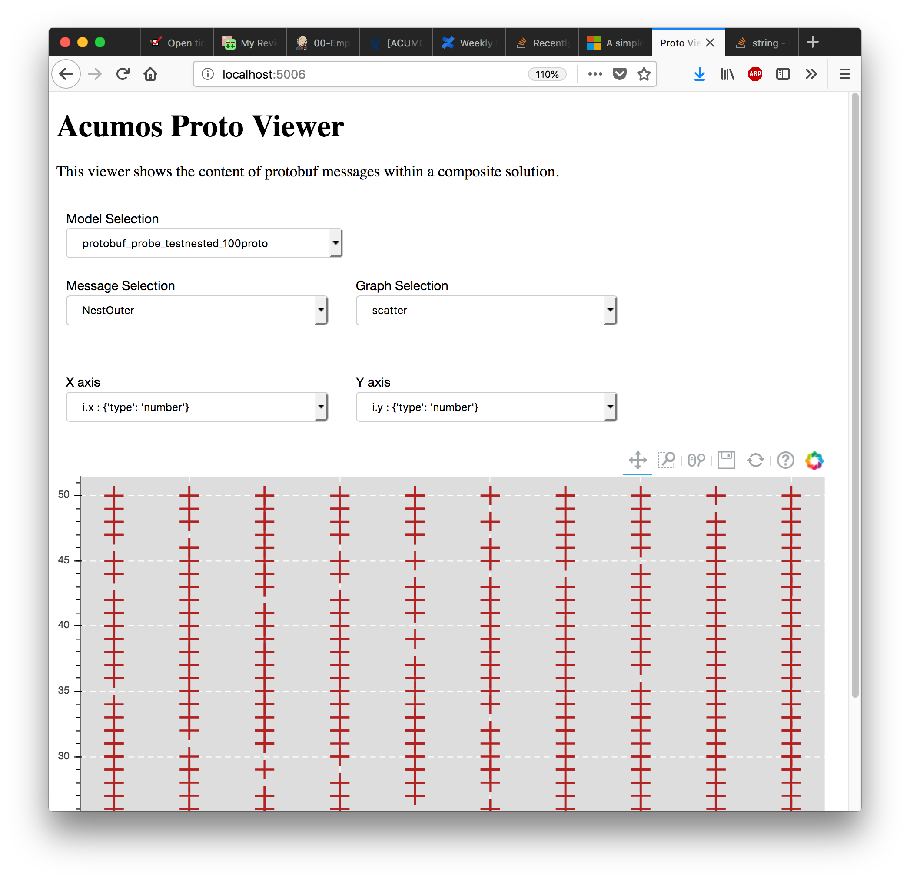

.. ===============LICENSE_START=======================================================
.. Acumos CC-BY-4.0
.. ===================================================================================
.. Copyright (C) 2017-2018 AT&T Intellectual Property & Tech Mahindra. All rights reserved.
.. ===================================================================================
.. This Acumos documentation file is distributed by AT&T and Tech Mahindra
.. under the Creative Commons Attribution 4.0 International License (the "License");
.. you may not use this file except in compliance with the License.
.. You may obtain a copy of the License at
..
..      http://creativecommons.org/licenses/by/4.0
..
.. This file is distributed on an "AS IS" BASIS,
.. WITHOUT WARRANTIES OR CONDITIONS OF ANY KIND, either express or implied.
.. See the License for the specific language governing permissions and
.. limitations under the License.
.. ===============LICENSE_END=========================================================

============================
Proto Viewer Developer Guide
============================

This project allows visualization of messages transferred in protobuf format.
This is a passive component that shows the messages explicitly delivered to it; 
it does not listen ("sniff") all network traffic searching for protobuf data.
Displaying the contents of a protobuf message requires the corresponding protocol 
buffer definition (.proto) file, which are fetched from a network server,
usually a Nexus registry.

Dependencies
============

If you are running in Docker there are no external dependencies, for better or worse[1] it is totally self contained.

If you are running locally, please follow the quickstart guide below.

[1] This Docker container runs Nginx, Redis, and Bokeh. The original requirements stated that the probe had to be a single Docker container.

Design
======

The proto-viewer enables viewing of binary-encoded protocol buffer messages
passed among elements of a composite solution by the runtime orchestrator
component. To display message content the proto-viewer must parse the binary
message using a protocol buffer message definition file. Those files are obtained
dynamically by the proto-viewer from network sources.

Messages are passed to the proto-viewer by the Acumos blueprint orchestrator
component, also known as the model connector.  The model connector makes HTTP POST
calls to deliver a copy of each message to the proto-viewer along with some details
about the message definition.

Each message POST-ed to the proto-viewer must contain only binary Protocol-Buffer
encoded content, and must include the following HTTP headers::

    PROTO-URL
    Message-Name

The "PROTO-URL" parameter can be either a complete URL (e.g., "http://host:port/path/to/file")
or just a suffix (e.g., "/path/to/file").  The URL is used to fetch the protocol
buffer specification file for the message.  The "Message-Name" parameter specifies the
name of the message (data structure) within that protocol buffer specification file,
which may define multiple messages.

If the PROTO-URL header parameter is just a suffix, the value of this environment
variable is consulted::

    NEXUSENDPOINTURL

This is expected to contain the prefix of a URL where the protocol buffer file can be
obtained; e.g., "http://host:port/context/path".

When the probe is sent the URL of a protocol buffer definition file, the probe
downloads the .proto file. The file is also cached for reuse if the same URL is
encountered again. One complication here is that the protoc tool fails for input
files that contain a dot or hyphen in the filename, so the filenames are mangled
by the proto-viewer to remove all offending characters. A second complication is
that the proto file is only downloaded once and changes will not be discovered;
but this should never happen without the version number changing.

The probe then invokes the "protoc" compiler on the definition file to generate a
Python module, working in a temporary directory.  Finally the proto-viewer imports
the newly created Python module and uses it to parse binary messages.

Data Retention
==============

The current server side (probe) data retention policy is that the raw
data cache resets every midnight. Meaning, if a user logs into the
probe, they will see all data that came in since the prior midnight, and
will see new data as it streams in. This is because the probe may be a
long running process, and memory would increase without bound, so the
probe has to have a TTL on data. If there is a need for a user to log in
and see MORE data than the prior midnight, we can change this later by
increasing the TTL to the last week or something.

For the client side, Bokeh has a notion of a DataSource per session,
which holds the data sent from the server to the browser, so we also
have to limit the client side data, in case a user is logged in for a
very long time. The “streaming limit” for numerical data is 100,000
records, just over a day of data assuming one record per second. The
streaming limit for images and raw data is just 1; the user sees it as
it goes by, or it is lost (there is currently no replay).

Filesystem
==========

This application makes the directory **/tmp/protofiles** and uses that
for the proto files. Inside Docker this all gets cleaned up. On your
machine if you run this, be sure to clean that after. Note many OSs
automatically clean up **/tmp** on reboot.

Build
=====

Follow these instructions to build the Docker image with all required software.
Please note "YOURREG" is a host name where a Docker registry server listens.

.. code:: bash

    docker build -t YOURREG:18443/acumos_proto_viewer:1.0.0 .
    docker push YOURREG:18443/acumos_proto_viewer:1.0.0

Run
===

Follow these instructions to launch the Docker image with the proto-viewer.

.. code:: bash

    docker run -dit -p 80:80 YOURREG:18443/acumos_proto_viewer:1.0.0

Optional additional environment variables
-----------------------------------------

You can also set the following environment variables to alter the proto-viewer behavior:

1. UPDATE_CALLBACK_FREQUENCY
   This sets the frequency (milliseconds, 1000=every second) of the callbacks that update the graphs on the screen, e.g., 500.

Extra Fields
============

Every protobuf message that enters the **/senddata** endpoint is
injected, by this server, with additional keys:

1. **apv_received_at**: the epoch timestamp when the model was received.
   Can be used for plotting a single variable against time
2. **apv_model_as_string**: the string representation of the entire
   model, used for plotting the raw message content and structure
3. **apv_sequence_number**: the sequence number of this “type” of raw
   data, where type = (model_id, message_name)

Development Quickstart
======================

The following steps set up a machine as a development and test environment without use of Docker,
which is convenient for use on a typical desktop/laptop.

0. Install prerequisites so they can be invoked by the probe:

    a. Python version 3.6+, ideally in a virtual environment
    b. The protocol buffer compiler ("protoc"), version 3.4 or later
    c. The `npm` tool, version 2.15.5 or later
    d. The `npm` package `protobuf-jsonschema`, version 1.1.1 or later (`npm install protobuf-jsonschema`)

1. Clone the proto-viewer repository (which you may already have done, since you're reading this)::

    git clone https://gerrit.acumos.org/r/proto-viewer

2. Download and build the redis server on the development machine::

    https://redis.io/download

3. Start the redis server on the development machine::

    src/redis-server

4. Create a virtual environment with Python 3.6 or later.  The name "apv36" is not magic, but will be used in all of the following directions::

    virtualenv -p python3.6 apv36

5. Use the newly created virtual environment to install the proto-viewer (i.e., this) python package::

    ./apv36/bin/pip install -r requirements.txt
    ./apv36/bin/pip install .

6. Start a Python HTTP server to publish the protocol buffer definition files. It uses port 8000 by default::

    cd tests/fixtures; ../../apv36/bin/python3 -m http.server

7. Set an environment variable with the appropriate URL of the Python HTTP server::

    export NEXUSENDPOINTURL=http://localhost:8000

8. Launch the Bokeh-enabled web server that is the proto-viewer::

    ./apv36/bin/python3 bin/run.py

9. Start the data-injection script::

    ./apv36/bin/python3 fake_data.py

10. Open a web browser::

    http://localhost:5006

Never ever change the port. It will not work. It will evolve to endless suffering. Darkness will envelop you. Essentially there's a bug in Bokeh.

Testing
=======

The proto-viewer can be tested standalone; i.e., without deploying a composite
solution to any cloud environment.  Follow the development quickstart instructions
above to install prerequisites and start the necessary servers.  Then use the 
data-generation script described next.

Data Injector
-------------

A Python script is provided to generate and send data to the probe.  The name is
"fake_data.py" and it can be found in the bin subdirectory.  Launch the script like this:

.. code:: bash

    fake_data.py [host:port]

**[host:port]** is an optional cmd line argument giving the target proto
to send data to; it defaults to **localhost:5006** for local development.

Test Messages
-------------

The test script creates and sends messages continually.  Those messages are cached within
the running Redis server.  The following message types are used:

1. image-mood-classification-100.
   This message carries an array of objects including an image.
2. probe-testimage-100
   This message carries a single image.
    Use this to test display of an image.
3. probe-testnested-100
   This message has a hierarchical message; i.e., an inner complex object within an outer complex object.
   Use this to test selection of nested fields.
4. probe-testxyz-100
   This message carries several numeric and string values.
   Use this to test plotting x, y values on various graphs.

Expected Behavior
-----------------

Use a web browser to visit the proto-viewer with the appropriate host and port, the default URL is the following::

    http://localhost:5006
    
Upon browsing to this URL a page like the following should load:

 |img-probe-start|

After the data-injection script has sent a few data points, follow these steps to view a plot of data
that arrives in a nested message:

1. In the Model Selection drop-down, pick item "protobuf_probe_testnested_100proto"
2. In the Message Selection drop-down, pick item "NestOuter"
3. In the Graph Selection drop-down, pick item "scatter"
4. In the X axis drop-down, pick item "i.x : {'type': 'number'}
5. In the Y axis drop-down, pick item "i.y : {'type': 'number'}

The page should change to resemble the following:

 |img-probe-plot|

